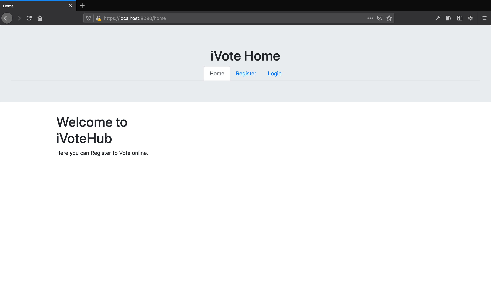
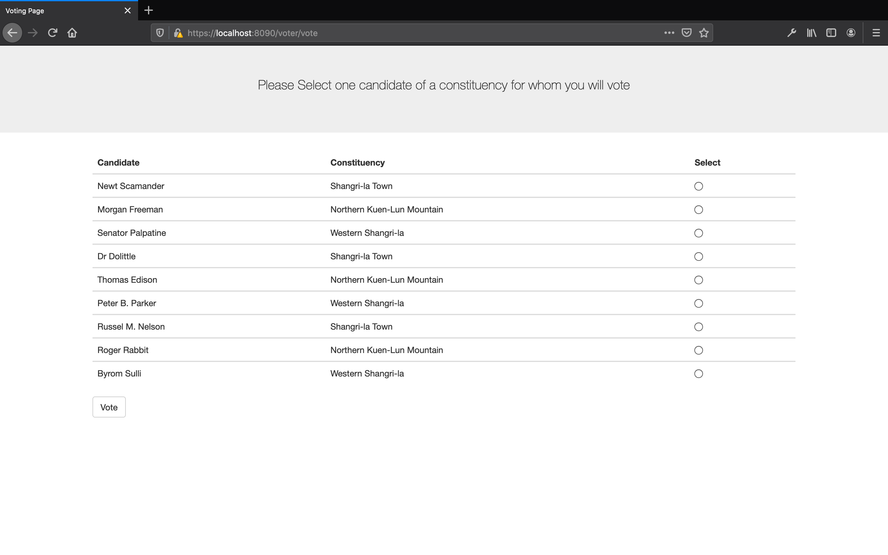
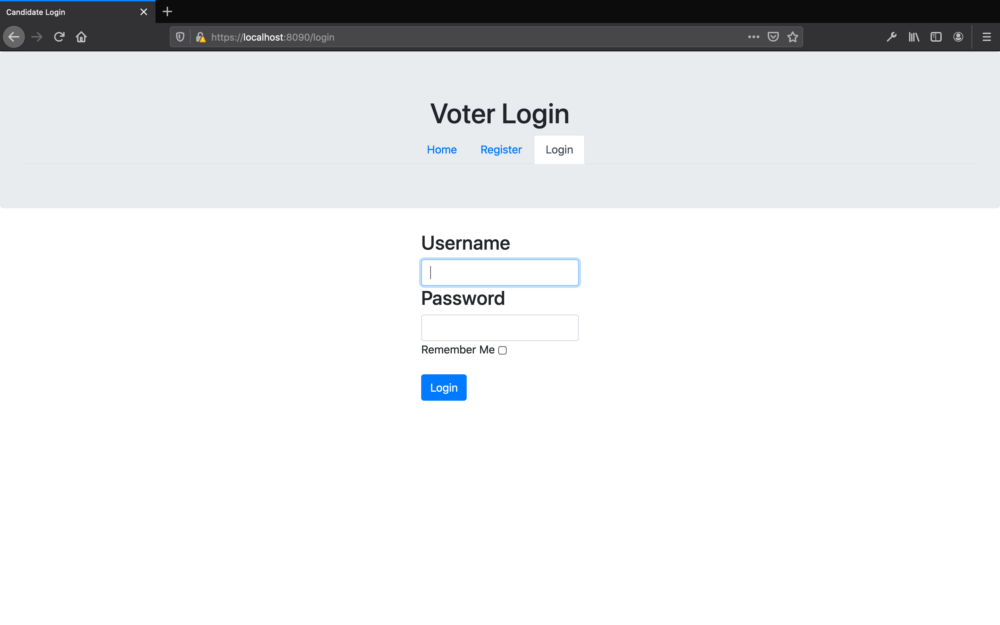
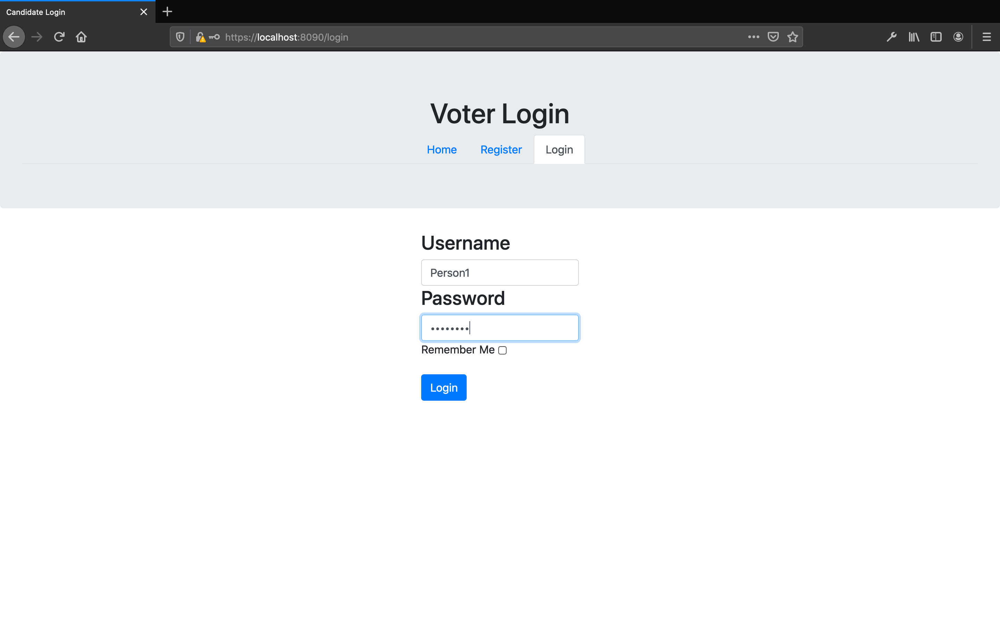
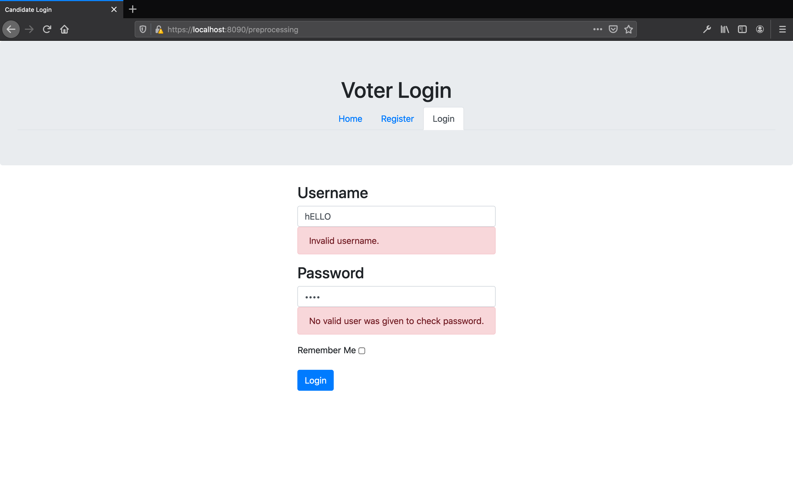
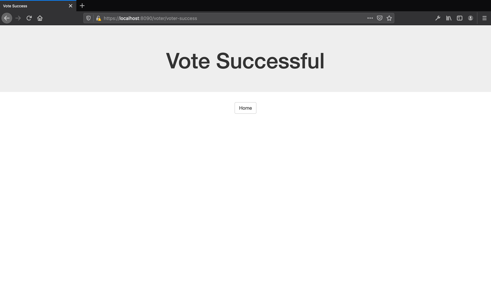
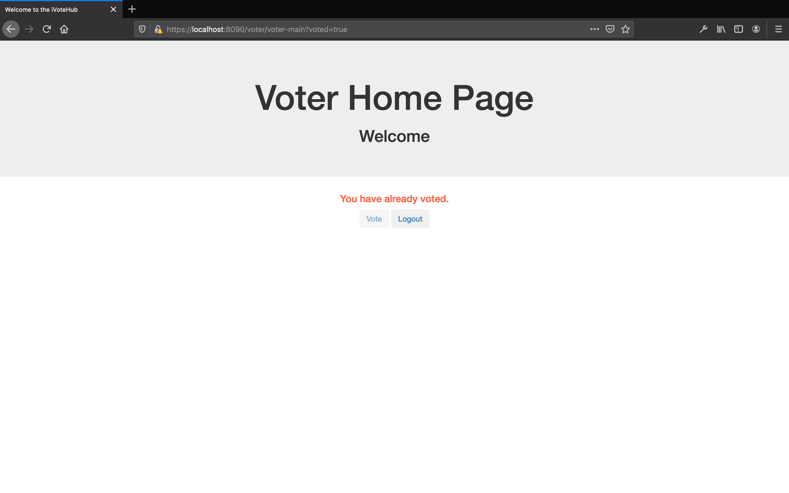
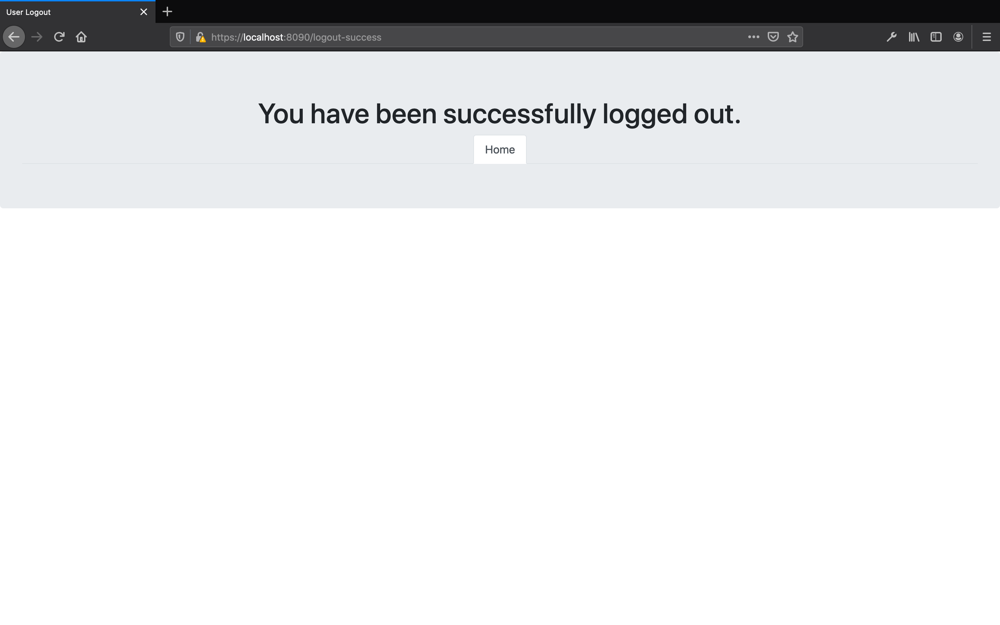

# iVoteHub - Web Technology Course Work 2


This was for an assignment in which we were asked to build a voting application. We were to pretend that it would be for a remote town that just recently recieved the right to vote and that this system would help ensure the process is carried out fairly. 


## Tables of Contents
* [Background](#background)
* [Technologies](#technologies)
* [Requirements to run the project](#requirements-to-run-the-project)
* [Setup](#setup)
* [Running the project](#running-the-project)
* [Project Shortcommings](#shortcommings)
* [Additional Notes](#additional-notes)
* [Images](#images)

## Background
We were given an assignemnt to create an application for instantaneous live voting. 

We were asked to build a site that would allow voters to register using a special national insurance number referd to as an SNI (Shangrila National Insurance number). Once registered, these voters could then vote.

Once an SNI is used to register, it cannot be used again.

Each voter should belong to one of 3 constituencies.

There are 3 main parties and one independent group (classed as a party essentially). Each party should have candidates.

The votes should be visible by the Admin.

The admin, candidates and 3 voters should already be registered. There should be other unused SNI's available for registration.

Constituencies:
- Shangri-la Town
- Northern Kuen-Lun Mountain
- Western Shangri-la

Parties:
- Blue Party
- Red Party
- Yellow Party
- Independent Party


## Technologies
- Java 
- Gradle
- Spring Boot + Spring Security
- Hibernate
- MySQL (orignially - now using H2Database for portability)
- JSP

## Requirements to run the project
You will need to have java 11 or higher installed and on your classpath in order to build and run this gradle project.

Optionally you can use a local installation of gradle 6.5.1 to build and run this, but there is a gradle wrapper provided for portability [see Running The Project](#running-the-project).


## Setup
The project was originally designed to work with MySQL which reqiured MySQL server setup and configuration but has been changed to use H2Database insteac for greater portability. 

Now you can simply pull the repository and the application using the gradle wrapper.


## Running the Project
From the terminal, cd the project directory. Once inside the directory: 

On Mac and Linux
```
./gradlew bootRun
```

On Windows
```
./gradlew.bat bootRun
```

Once the boot process is complete, you can then view the website from https://localhost:8090/home (if you are using default configurations). 

## Trying out the Application

You can login to the application using these credentials:
|UserType|Username| Password| SNI|
|:-------:|:-------:|:-------:|:-------:|
|ADMIN|ADMIN |ADMIN| n/a|
|VOTER|Person0|password|OXFG75MZ|
|VOTER|Person1|password|B7F6EM2Y|
|VOTER|Person2|password|Q7OW5WWM|
|VOTER|Person3|password|7XP02HJ3|
|||||


There for each type their are 3 users (i.e. {usertype}{number} - e.g. Admin2). 

The admin functionality is the most complete of the 3 system user types, though there remains still a lot of work to 

List of all SNI's (directly from code):
```
SNI s0 = new SNI("OXFG75MZ");//used 
SNI s1 = new SNI("B7F6EM2Y");//used
SNI s2 = new SNI("Q7OW5WWM");//used
SNI s3 = new SNI("7XP02HJ3");//used
SNI s4 = new SNI("FWM4HQEQ");
SNI s5 = new SNI("R824O2NZ");
SNI s6 = new SNI("JTP70XGU");
SNI s7 = new SNI("P8AO57RS");
SNI s8 = new SNI("S3ATWJUZ");
SNI s9 = new SNI("4M6YFNAC");
SNI s10 = new SNI("RR9E1MBQ");
SNI s11 = new SNI("DABSP97S");
SNI s12 = new SNI("XIO0FT40");
SNI s13 = new SNI("Z4PHBVY9");
SNI s14 = new SNI("G9H3FM8G");
SNI s15 = new SNI("4817YN1C");
SNI s16 = new SNI("70EV6SC4");
SNI s17 = new SNI("AUTIHS8I");
SNI s18 = new SNI("72GQU9ZK");
SNI s19 = new SNI("P4YHAJUX");
```


## Project Shortcommings - (8TH July 2021 Update - Now uses AJAX)
I created this before I learnt how to use AJAX so you will notice that the admin's view of the results are refreshed every so often instead of true live loading of the results. When I get the chance, I'll update the site API's with some rest controllers for AJAX use.
(Update - Now uses AJAX for that section)

## Additional Notes
The project website uses a self-signed certificate so may not work on Safari, in which case I recommend opening it in FireFox or Google Chrome which which after displaying a warning allows you the option to proceed to open the page.

## Images










